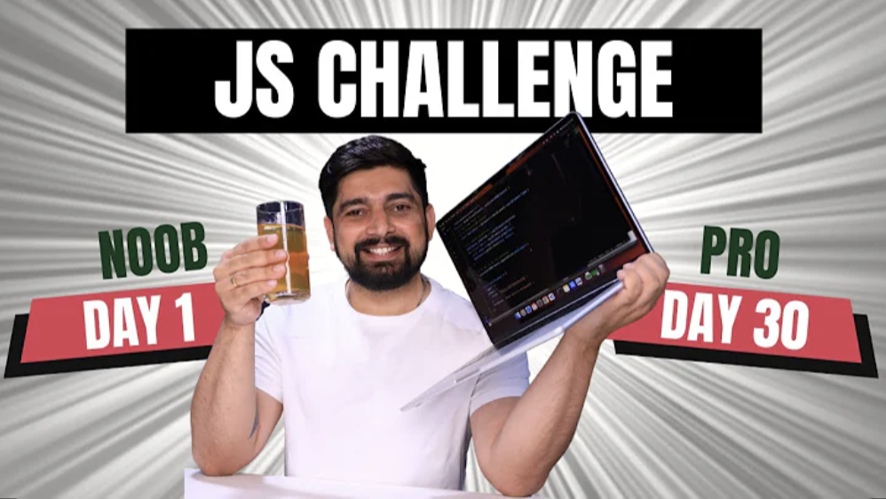

# 30 Days Javascript Challange

## Activities

| Day | Challenge                | What I Learn                                                                                                                                                                        |
| --- | ------------------------ | ----------------------------------------------------------------------------------------------------------------------------------------------------------------------------------- |
| 1   | Variables and Data Types | day 1 i learn how to declare variable using `let`, `var` ,`const` understand the different data type and type of and undersatnds varible reassignment and the immutability of const |

| 2 | Operators | day 2 i prectice `Arithmatic` , `Comparision` , `Logical` , `Assignment` , `Ternory` operator |

### **Stretch Goals**

- That's my goal to revise javascript from beginner 😊😊
